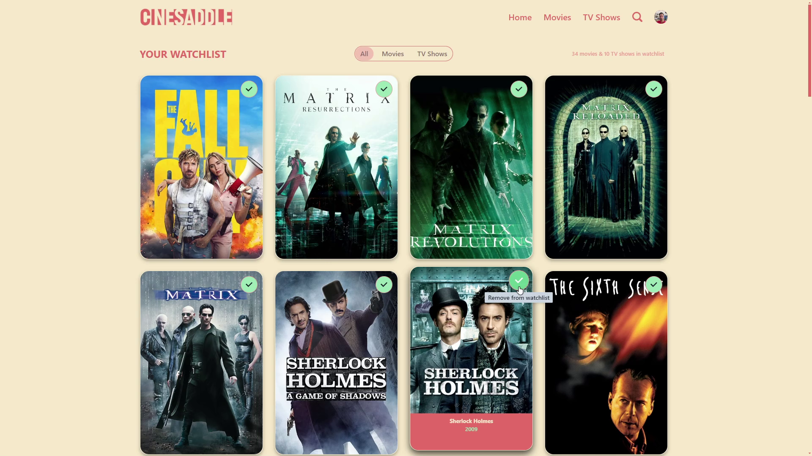
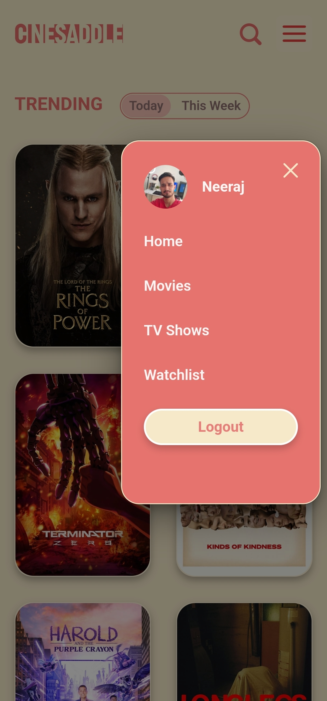

# 🎬 CineSaddle

Welcome to **CineSaddle**, the ultimate destination for movie enthusiasts! Whether you're looking to discover new films or keep track of your all-time favorites, CineSaddle provides a beautifully crafted platform tailored just for you. With a focus on ease of use and visual appeal, CineSaddle is designed to offer a seamless experience across all your devices.

## 🌟 Features

- **🎨 Beautiful and Easy-to-Navigate UI**: CineSaddle's interface is not just functional but also aesthetically pleasing. Every page is designed with user experience in mind, ensuring you can easily explore and manage your watchlist without any hassle.

- **🔐 Firebase Authentication and Database**: Your watchlist is securely stored and managed through Firebase. Sign in to keep your personalized movie collection updated and accessible wherever you go.

- **🖼️ Download Movie Wallpapers**: Love the visuals of a movie? Download high-quality wallpapers directly from CineSaddle and give your devices a cinematic touch.

- **🎭 Detailed Cast Information**: Want to know more about the stars of your favorite movies? CineSaddle offers detailed cast pages where you can explore biographies, filmographies, and more.

- **🎬 Explore and Add to Watchlist**: Browse through an extensive collection of movies and TV shows, watch trailers, get recommendations, and easily add them to your watchlist for later viewing.

- **✨ Smooth Scrolling and Animations**: Experience the joy of browsing with smooth scrolling animations that enhance the visual experience as you navigate through the site.

## 🚀 Getting Started

Ready to dive into the world of movies? Visit CineSaddle now and start exploring:

🔗 **Hosted Link**: [CineSaddle](https://cine-saddle-one.vercel.app/)

## 🛠️ Technologies Used

CineSaddle is built using modern web technologies to ensure a smooth and responsive user experience:

- **ReactJS**: For building a dynamic and responsive user interface.
- **Firebase**: For secure authentication and real-time database management.
- **TMDB API**: For providing up-to-date movie and TV show data.
- **CSS**: For styling and creating smooth animations.
- **Chakra UI**: For building accessible and highly customizable components with ease.
- **Vercel**: For efficient and reliable hosting of the application.

## 📸 Screenshots

Here are some screenshots showcasing the different pages and features of CineSaddle:

- **🏠 Home Page**:
  
- **🔍 Discover Movies/Shows**:
  
- **📄 Movie Details Page**:
  
- **🎥 Cast and Trailers**:
  
- **🖼️ Download Wallpapers**:
  
- **📋 Watchlist Page**:
  
- **👤 Cast Information Page**:
  

## 📱 Mobile Screenshots

CineSaddle is fully responsive and offers a seamless experience on mobile devices. Here are the mobile views displayed in a two-column layout:

| **📱 Mobile Home Page** | **📱 Mobile Sidebar** |
|:----------------------:|:--------------------:|
|  |  |
| **📱 Mobile Watchlist Page** | **📱 Mobile Movie Details Page** |
|  |  |

## 🤝 Contributing

I welcome contributions! If you have ideas for new features or improvements, or if you encounter any issues, please feel free to submit a pull request or open an issue. Your input is highly appreciated and helps make CineSaddle even better.

## 📫 Connect with Me

If you’d like to get in touch or learn more about my work, you can connect with me on LinkedIn:

[My LinkedIn](https://www.linkedin.com/in/neerajsingh19/)

## 📄 License

This project is licensed under the MIT License.

---

Thank you for exploring CineSaddle! Enjoy watching and managing your favorite movies and TV shows with me.
